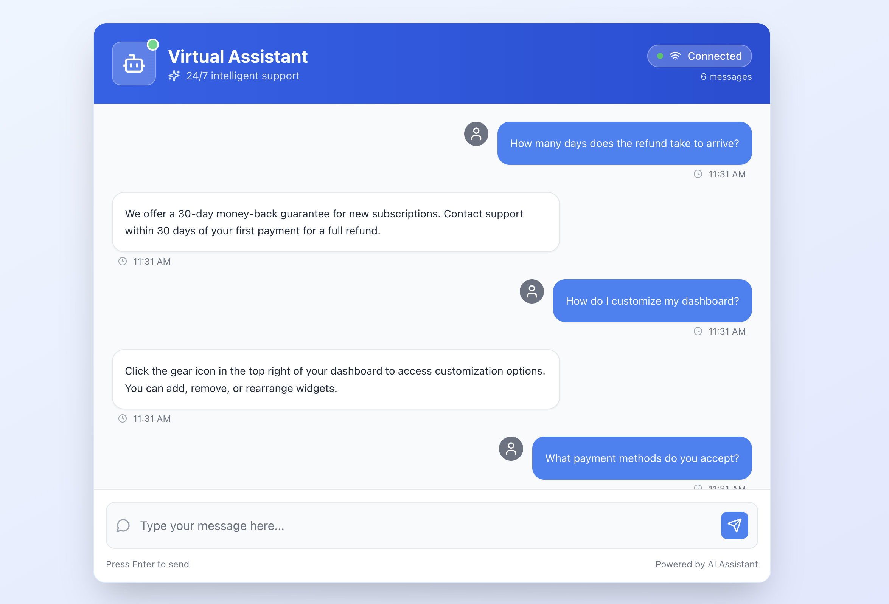

# Multi-Agent Customer Chat System

[](https://www.python.org/)
[](https://fastapi.tiangolo.com/)
[](https://nextjs.org/)
[](https://github.com/langchain-ai/langgraph)
[](https://ai.google.dev/gemini-api)
[](https://www.docker.com/)
[](https://www.postgresql.org/)
[](https://redis.io/)
[]()


**Next-generation real-time customer support platform with modular multi-agent AI, human fallback, and robust safety guardrails.**

*Deliver instant, intelligent, and safe customer support at scale with seamless escalation to human agents.*

[Quick Start](#quick-start) • [Features](#features) • [Architecture](#architecture) • [API Reference](#api-reference) • [Configuration](#configuration) • [Troubleshooting](#troubleshooting)


## What Makes This Special?

This is not just another chatbot. It's a **production-ready, enterprise-grade platform** that combines advanced AI agents, real-time communication, and robust safety mechanisms to deliver **intelligent customer support** with reliability and speed.

- **5x Faster** with Redis-powered real-time messaging
- **Seamless Human Escalation** when AI can't resolve
- **Enterprise Security** with strict guardrails and validation
- **Plug-and-Play Agents** for easy extensibility
- **Modern UI** built with Next.js and Tailwind CSS




## Architecture


### Agent Orchestration
- **LangGraph Workflow**: Central message router and workflow coordinator
- **Router Agent**: Intent classification and message routing
- **FAQ Agent**: Knowledge base responses for common questions
- **Support Agent**: Complex query handling and external system integration
- **Guardrails Agent**: Safety validation and content filtering
- **Escalation Agent**: Human handoff coordination

### Data Layer
- **PostgreSQL**: Primary database for sessions, knowledge base, and user data
- **Redis**: Chat state caching and real-time message handling

## Technology Stack

### Backend
- **Framework**: FastAPI with async support
- **Agent Framework**: LangGraph for workflow orchestration
- **LLM Integration**: Google Gemini via google-genai 1.25.0 SDK
- **Database**: PostgreSQL with asyncpg (direct connection, no ORM)
- **Caching**: Redis for real-time state management
- **Monitoring**: Built-in LangGraph observability and logging

### Frontend
- **Framework**: Next.js 14 with App Router
- **Styling**: Tailwind CSS
- **State Management**: React hooks with Context API
- **WebSocket**: Native WebSocket API with reconnection logic
- **Type Safety**: TypeScript with strict configuration

### Infrastructure
- **Development**: Docker Compose for local development
- **Containerization**: Multi-stage Dockerfiles for production optimization
- **Database**: PostgreSQL container with persistent volumes
- **Cache**: Redis container with memory optimization

## Quick Start

### Prerequisites
- Docker & Docker Compose
- Node.js 18+
- Google Gemini API Key

### 1. Clone the Repository

```bash
git clone <repository-url>
cd multi-agent-customer-chat
```

### 2. Configure Environment

Copy and edit the example environment file:
```bash
cp env.example .env
```

Edit `.env` with your configuration:

```bash
# Gemini AI Configuration
GOOGLE_API_KEY=your_gemini_api_key_here

# Database Configuration (Docker)
POSTGRES_DB=""
POSTGRES_USER=""
POSTGRES_PASSWORD=""
DATABASE_URL=""
REDIS_URL=""

# Application Configuration
ENVIRONMENT=development
```

### 3. Launch the System

Start all services using Docker Compose:

```bash
docker-compose up -d
```

This will start:
- Backend API server on port 8000
- Frontend application on port 3000
- PostgreSQL database on port 5432
- Redis cache on port 6379

### 4. Access the Application

Open your browser and navigate to:
- **Frontend**: http://localhost:3000
- **Backend API**: http://localhost:8000
- **API Documentation**: http://localhost:8000/docs

### 5. Verify Installation

Check that all services are running:

```bash
docker-compose ps
```

Test the API health endpoint:

```bash
curl http://localhost:8000/health
```

## Development

### Project Structure

```
multi-agent-customer-chat/
├── backend/                 # FastAPI backend application
│   ├── app/
│   │   ├── agents/         # LangGraph agent implementations
│   │   ├── main.py         # Application entry point
│   │   ├── config.py       # Environment configuration
│   │   ├── database.py     # Database connection management
│   │   ├── websocket.py    # WebSocket endpoint handler
│   │   ├── api.py          # REST API endpoints
│   │   ├── workflow.py     # LangGraph workflow definition
│   │   └── gemini_client.py # Gemini AI client configuration
│   ├── test/               # Comprehensive test suite
│   ├── Dockerfile          # Backend container configuration
│   └── pyproject.toml      # Python dependencies (uv)
├── frontend/               # Next.js frontend application
│   ├── app/                # Next.js app directory
│   ├── components/         # React components
│   ├── hooks/              # Custom React hooks
│   ├── lib/                # Utility libraries
│   ├── Dockerfile          # Frontend container configuration
│   └── package.json        # Node.js dependencies
├── docs/                   # Documentation and architecture diagrams
├── docker-compose.yml      # Development environment configuration
└── README.md              # This file
```

### Local Development

For local development without Docker:

#### Backend Development

```bash
cd backend
uv sync
uvicorn app.main:app --reload --host 0.0.0.0 --port 8000
```

#### Frontend Development

```bash
cd frontend
npm install
npm run dev
```

### Database Management

Initialize the database schema:

```bash
# Using Docker
docker-compose exec backend python -m app.database init

# Local development
cd backend
uv run python -m app.database init
```

### Testing

Run the comprehensive test suite:

```bash
# Run all tests
cd backend
uv run python -m test.run_all_tests

# Run specific test categories
uv run python -m test.test_agents
uv run python -m test.test_workflow
uv run python -m test.test_guardrails
```

## Agent System

### Router Agent
Classifies incoming messages and routes them to appropriate specialized agents based on intent and content analysis.

### FAQ Agent
Handles common questions using a knowledge base with semantic search capabilities. Provides contextual responses based on conversation history.

### Support Agent
Manages complex customer queries requiring external system integration, order tracking, and detailed problem resolution.

### Guardrails Agent
Ensures all responses meet safety and quality standards through content filtering, validation, and policy enforcement.

### Escalation Agent
Determines when human intervention is needed and manages the handoff process while preserving conversation context.

## API Reference

### WebSocket Endpoints

- `ws://localhost:8000/ws` - Real-time chat connection

### REST API Endpoints

- `GET /health` - System health check
- `GET /sessions` - List chat sessions
- `POST /sessions` - Create new session
- `GET /sessions/{session_id}/messages` - Get session messages
- `POST /sessions/{session_id}/messages` - Send message to session

### Message Format

```json
{
  "session_id": "uuid",
  "sender": "user|agent",
  "content": "message content",
  "message_type": "text|system|error",
  "metadata": {}
}
```

## Configuration

### Environment Variables

| Variable | Description | Default |
|----------|-------------|---------|
| `GOOGLE_API_KEY` | Google Gemini API key | Required |
| `DATABASE_URL` | PostgreSQL connection string | Required |
| `REDIS_URL` | Redis connection string | Required |
| `ENVIRONMENT` | Application environment | `development` |
| `LOG_LEVEL` | Logging level | `INFO` |

### Agent Configuration

Each agent can be configured through environment variables or configuration files:

- **Router Agent**: Intent classification thresholds
- **FAQ Agent**: Knowledge base search parameters
- **Support Agent**: External API endpoints and credentials
- **Guardrails Agent**: Content filtering rules and safety thresholds
- **Escalation Agent**: Escalation criteria and human agent routing

## Monitoring and Observability

### Built-in Monitoring
- LangGraph workflow tracing and metrics
- Request/response logging with correlation IDs
- Agent performance monitoring
- Database query performance tracking

### Health Checks
- API health endpoint with detailed status
- Database connectivity monitoring
- Redis cache health verification
- Agent availability checks

### Logging
Structured logging across all components with configurable levels and output formats.


## Performance

### Optimization Features
- Connection pooling for database and Redis
- Response caching for frequent queries
- Asynchronous processing for all operations
- Optimized agent workflow execution

### Scalability
- Horizontal scaling support for all components
- Load balancing ready architecture
- Stateless design for easy deployment
- Resource-efficient container configurations

## Troubleshooting

### Common Issues

**Docker Compose Issues**
```bash
# Reset Docker environment
docker-compose down -v
docker-compose up -d

# Check service logs
docker-compose logs backend
docker-compose logs frontend
```

**Database Connection Issues**
```bash
# Verify database is running
docker-compose ps postgres

# Check database logs
docker-compose logs postgres

# Test database connection
docker-compose exec backend uv run python -c "from app.database import get_db; print('DB OK')"
```

**WebSocket Connection Issues**
```bash
# Check WebSocket endpoint
curl -I http://localhost:8000/ws
```

### Performance Monitoring

Monitor system performance:

```bash
# Check resource usage
docker stats

# Monitor API response times
curl -w "@curl-format.txt" -o /dev/null -s http://localhost:8000/health
```

